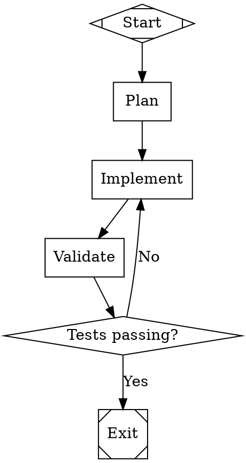

# Attractor

A DOT-based pipeline runner that uses directed graphs (defined in Graphviz DOT syntax) to orchestrate multi-stage AI workflows. Each node in the graph is an AI task and edges define the flow between them.

Built from the [StrongDM Software Factory](https://factory.strongdm.ai/) NLSpecs:

- [Attractor Specification](https://github.com/strongdm/attractor/blob/main/attractor-spec.md) — Pipeline engine
- [Coding Agent Loop Specification](https://github.com/strongdm/attractor/blob/main/coding-agent-loop-spec.md) — Provider-aligned agentic loop
- [Unified LLM Client Specification](https://github.com/strongdm/attractor/blob/main/unified-llm-spec.md) — Multi-provider LLM SDK

## Architecture

Three layers, built bottom-up:

```
┌─────────────────────────────────────────┐
│  Attractor Pipeline Engine              │  DOT parser, execution engine,
│  (src/pipeline/)                        │  handlers, conditions, stylesheet
├─────────────────────────────────────────┤
│  Coding Agent Loop                      │  Session, provider profiles,
│  (src/agent/)                           │  tool execution, truncation
├─────────────────────────────────────────┤
│  Unified LLM Client                     │  Client, providers, retry,
│  (src/llm/)                             │  error hierarchy, model catalog
└─────────────────────────────────────────┘
```

## Quick Start

### Define a pipeline in DOT syntax



### Run the pipeline

```ts
import { parseDot, validateOrRaise, runPipeline } from "attractor";

const dot = fs.readFileSync("pipeline.dot", "utf-8");
const graph = parseDot(dot);
validateOrRaise(graph);

const result = await runPipeline({
  graph,
  logsRoot: "./logs",
  backend: myCodergenBackend,  // Your LLM integration
  onEvent: (event) => console.log(event.kind, event.data),
});
```

## Pipeline Engine Features

### DOT Parsing (Section 2)
- Full subset of Graphviz DOT: digraph, node/edge attributes, subgraphs
- Chained edges (`A -> B -> C`), node/edge defaults, comments
- Typed attributes: strings, integers, floats, booleans, durations

### Node Handlers (Section 4)
| Shape | Handler | Description |
|-------|---------|-------------|
| `Mdiamond` | `start` | Pipeline entry point (no-op) |
| `Msquare` | `exit` | Pipeline exit point (no-op, goal gate check) |
| `box` | `codergen` | LLM task with `$goal` variable expansion |
| `hexagon` | `wait.human` | Human-in-the-loop gate |
| `diamond` | `conditional` | Routing based on edge conditions |
| `parallelogram` | `tool` | External tool execution |

### Edge Selection (Section 3.3)
5-step deterministic priority: condition match → preferred label → suggested IDs → weight → lexical tiebreak

### Condition Expressions (Section 10)
```dot
gate -> exit      [condition="outcome=success"]
gate -> fix       [condition="outcome=fail"]
gate -> deploy    [condition="outcome=success && context.tests_passed=true"]
```

### Goal Gates (Section 3.4)
Nodes with `goal_gate=true` must succeed before the pipeline can exit.

### Model Stylesheet (Section 8)
CSS-like rules for per-node LLM configuration:
```dot
graph [model_stylesheet="
    * { llm_model: claude-sonnet-4-5; }
    .code { llm_model: claude-opus-4-6; }
    #critical { llm_model: gpt-5.2; reasoning_effort: high; }
"]
```

### Checkpoint & Resume (Section 5.3)
Execution state saved after each node. Resume from any checkpoint.

### Human-in-the-Loop (Section 6)
Built-in interviewers: `AutoApproveInterviewer`, `QueueInterviewer`, `CallbackInterviewer`, `RecordingInterviewer`.

## Unified LLM Client

```ts
import { Client, generate } from "attractor/llm";

const client = new Client({
  providers: { anthropic: myAnthropicAdapter },
});

const result = await generate({
  model: "claude-opus-4-6",
  prompt: "Explain quantum computing",
  client,
});
```

Features: provider routing, middleware, retry with backoff, error hierarchy, model catalog, tool execution loop.

## Coding Agent Loop

```ts
import { Session, LocalExecutionEnvironment, CORE_TOOLS } from "attractor/agent";

const session = new Session({
  profile: myProviderProfile,
  env: new LocalExecutionEnvironment("/path/to/project"),
  client: myLlmClient,
});

session.onEvent((event) => console.log(event.kind));
await session.submit("Fix the login bug");
```

Features: provider-aligned toolsets, tool output truncation (char + line), steering/follow-up, loop detection, subagent support.

## Project Structure

```
src/
├── llm/                    Unified LLM Client
│   ├── types.ts            Core types, error hierarchy
│   ├── client.ts           Client, generate(), middleware
│   ├── retry.ts            Exponential backoff with jitter
│   ├── errors.ts           HTTP status → error mapping
│   └── catalog.ts          Model catalog
├── agent/                  Coding Agent Loop
│   ├── types.ts            Session types, execution environment
│   ├── session.ts          Core agentic loop
│   ├── tools.ts            Shared tools (read, write, edit, shell, grep, glob)
│   ├── truncation.ts       Output truncation (char + line)
│   └── local-env.ts        Local execution environment
└── pipeline/               Attractor Pipeline Engine
    ├── types.ts            Graph model, context, handlers, interviewers
    ├── dot-parser.ts       DOT subset parser
    ├── validator.ts        Lint rules (13 built-in)
    ├── conditions.ts       Edge condition expression language
    ├── engine.ts           Core execution loop, edge selection, checkpoints
    ├── handlers.ts         Node handlers + registry
    ├── interviewers.ts     Human-in-the-loop implementations
    └── stylesheet.ts       CSS-like model stylesheet
```

## Development

```sh
npm install
npm run build
npm test        # 56 tests
```
